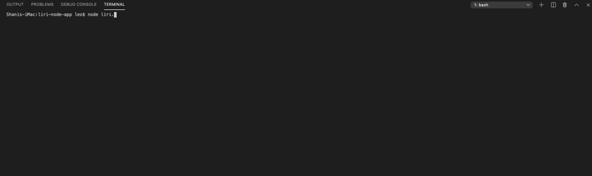
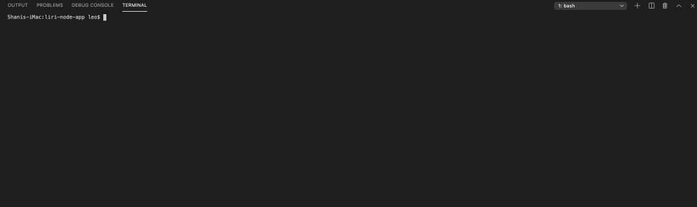
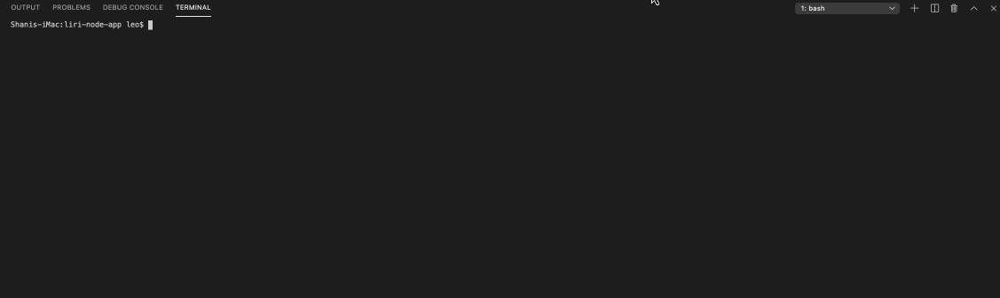
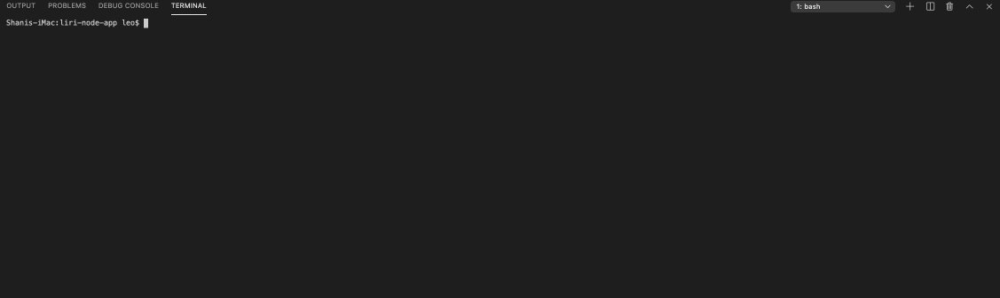

# **LIRI *(Language Interpretation and Recgonition Interface)* NODE APP** 

### What LIRI Does
Liri utilizes Spotify, Bands in Town, and OMDB to search for songs, concerts and movies. LIRI is built to run inside of your Terminal/Git Bash and is controlled by a simple set of commands. 

### Instructions
To use LIRI, clone this repository into your a folder on your computer. Enter the folder using Terminal or Git Bash. 

#### Commands
**ALL COMMANDS TO BE EXECUTED AFTER CALLING NODE AND THE LIRI PROGRAM:**

*node liri.js*
###### Song Search:
*spotify-this-song*
###### Movie Search:
*movie-this*
###### Concert Search:
*concert-this*
###### Random Selection From User History **(Will only work if there is a User History):**
*random-history*
###### Display User History **(Will only work if there is a User History):**
*display-history*

#### Using Commands - 
#### Spotify Song Search:
To search for a song, type the following into the command line. 
  *node liri.js spotify-this-song usersong*
  

#### Movie Search:
To search for a movie, type the following into the command line.
  *node liri.js movie-this usermovie*
  
  
#### Concert Search:
To search for a concert, type the following into the command line.
  *node liri.js concert-this userband*
  
 
#### Random Selection from User History:
To randomly select a previous search from user history type the following into the command line.
  *node liri.js random-history*
  
 
#### Display all of User History
To display the User History in it's entirety, type the following into the command line.
  * node liri.js display-history*
  

## OverView
The app uses node plug-ins *Axios*, *Moment*, *Node Spotify API*, and *DotEnv*. *Axios* is used for API calls to *Node-Spotify-API*(which supplies the response for *spotify-this-song*), OMDB API (which supplies the response for *movie-this*), and Bands In Town API (which supplies the response for *concert-this*).
*Moment* is used to convert the "datetime" response from Bands In Town in order to present the user with a MM/DD/YYYY format.
*DotEnv* is used to load environment variables from a .env file into *process.env*.
